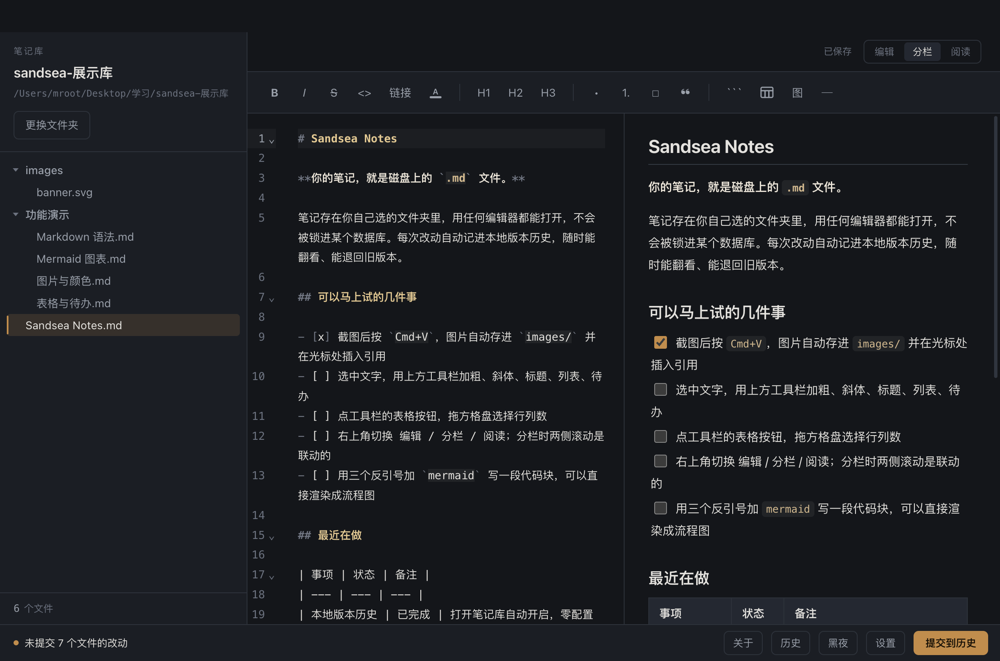
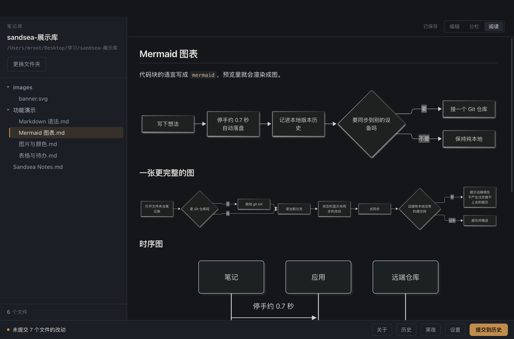
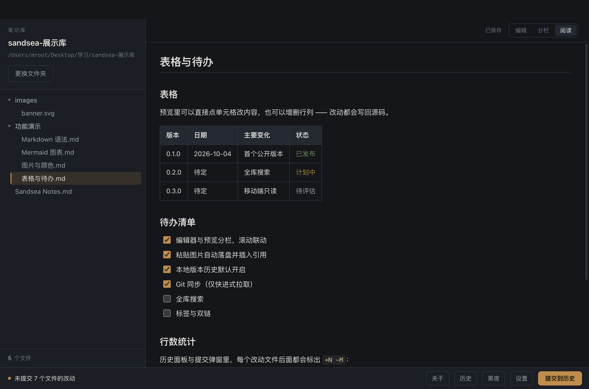
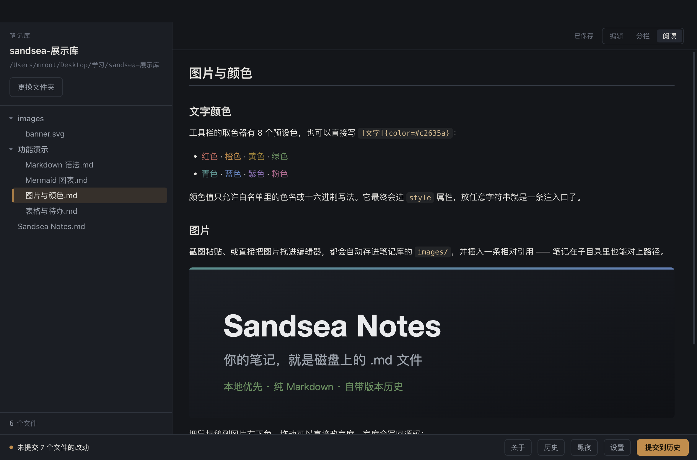
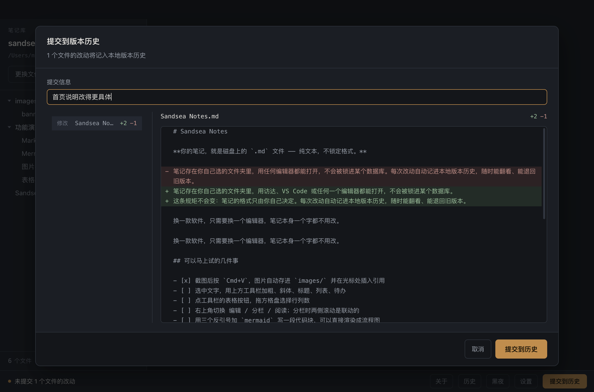
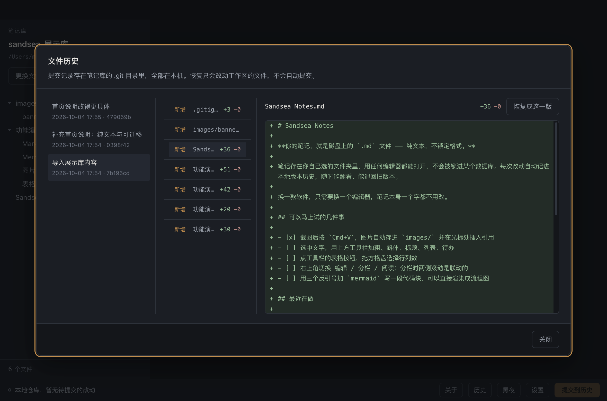

# Sandsea Notes

**Your notes are just `.md` files on disk.**

Sandsea Notes is a local-first Markdown note-taking app. Your notes live in a folder you choose, they can be opened with any editor, and they aren't locked into some database. Every change is recorded in local version history automatically, so you can browse old revisions at any time and roll a file back; when you need to sync across machines, just point that folder at a Git repository.

[](./LICENSE)
[](#installation)
[](https://www.electronjs.org/)
[](https://react.dev/)
[](https://www.typescriptlang.org/)

[简体中文](./README.md) · **English**

Repositories: [Gitee](https://gitee.com/hanhaiszw/sandsea-notes) · [GitHub](https://github.com/hanhaiszw/sandsea-notes)

---

## Features

- **Notes are files** — plain `.md` in the folder you choose, no locked-in format, no import into a database, and you can switch apps whenever you like
- **Pleasant to write in** — source editing + live preview, with autosave when you stop typing; headings, lists, tables, and text colors insert with one click
- **Pasting images is painless** — a screenshot goes in with `Cmd+V` and is saved into the vault automatically with a reference; drag it in the preview to resize
- **Three views** — edit / split / reading, switchable at any time, with Mermaid diagrams, task lists, and footnotes; tick tasks and edit tables right in the preview
- **Light and dark themes** — follow the system, or switch manually
- **Version history** — switched on automatically when you open a vault, no setup. Browse the line-by-line diff of any change with no network, and roll a single file back to an older revision
- **Git sync (optional)** — connect GitHub / Gitee to commit-and-push across devices; works even if git isn't installed (built-in implementation)
- **Purely local** — no network requests beyond the Git remote you configure, and no telemetry

## Screenshots

**Source and preview side by side, scroll-linked** — write on the left, see the result on the right; the toolbar covers headings, lists, tasks, tables and text colours.



**Mermaid diagrams** — name the code fence `mermaid` and it renders as a diagram.



**Editable right in the preview** — tick tasks, edit table cells, add or remove rows and columns; the changes are written back to the source.

| Tables and tasks | Images and colours |
| --- | --- |
|  |  |

**Version history** — on by default the moment you open a vault; review what changed before committing, browse three columns of history, and restore a single file to an older version.

| Commit and diff | File history |
| --- | --- |
|  |  |

## Installation

### Regular users

**No prebuilt package is available yet** — please build it yourself as described in "Running from source" below. Two reasons: the GitHub / Gitee Releases have no attachments, and the `.dmg` comes out at about 141 MB, above Gitee's 100 MB per-attachment limit.

### Running from source

Requires **Node.js 20.19+ or 22.12+**. macOS (Apple Silicon) only for now.

```bash
git clone https://gitee.com/hanhaiszw/sandsea-notes.git
cd sandsea-notes
npm install
npm run dev
```

On networks in mainland China, it's advisable to route the Electron binary through a mirror:

```bash
ELECTRON_MIRROR=https://npmmirror.com/mirrors/electron/ npm install
```

To package it into a double-clickable `.app`, or straight into a `.dmg`:

```bash
npm run pack   # output is at release/mac-arm64/Sandsea Notes.app
npm run dmg    # output is at release/Sandsea Notes-0.1.0-arm64.dmg
```

> Builds are unsigned: they open fine on your own machine, but once you pass them to someone else
> through a browser or cloud drive, their first launch is blocked by Gatekeeper and has to be
> allowed in System Settings → Privacy & Security.

## Getting Started

1. **Choose a vault** — on first launch, click "Choose Folder" and pick a folder (empty, or one that already has notes — either is fine)
2. **Create a note** — right-click in the file tree on the left → "New Note", then just start writing
3. **Don't worry about saving** — changes are written to disk about 0.7 seconds after you stop typing, and `Cmd+S` saves immediately

## Keyboard Shortcuts

| Shortcut | Action |
|---|---|
| `Cmd+S` / `Ctrl+S` | Save immediately |
| `Cmd+B` / `Ctrl+B` | Bold the selection |
| `Cmd+I` / `Ctrl+I` | Italicize the selection |
| `Tab` / `Shift+Tab` | Indent / outdent |

## Documentation

| Document | Contents |
|---|---|
| [Manual](./docs/manual.en.md) | Full feature documentation: toolbar, images, version history and sync, data and security, FAQ |
| [技术方案.md](./技术方案.md) | Design document (Chinese): architecture layers, technology choices, security baseline, design decisions |

## Contributing

Issues and PRs are welcome. Before submitting, please make sure **`npm run typecheck` passes** — both the main and renderer processes are strictly type-checked, and type errors will block a merge.

Before changing code, please familiarize yourself with the project's layering and security baseline, see [Manual · Contributing](./docs/manual.en.md#11-contributing).

## License

[MIT](./LICENSE) © 2026 Sandsea Notes contributors

You're free to use, modify, and distribute this project, including for commercial purposes, as long as you keep the copyright and license notice.
