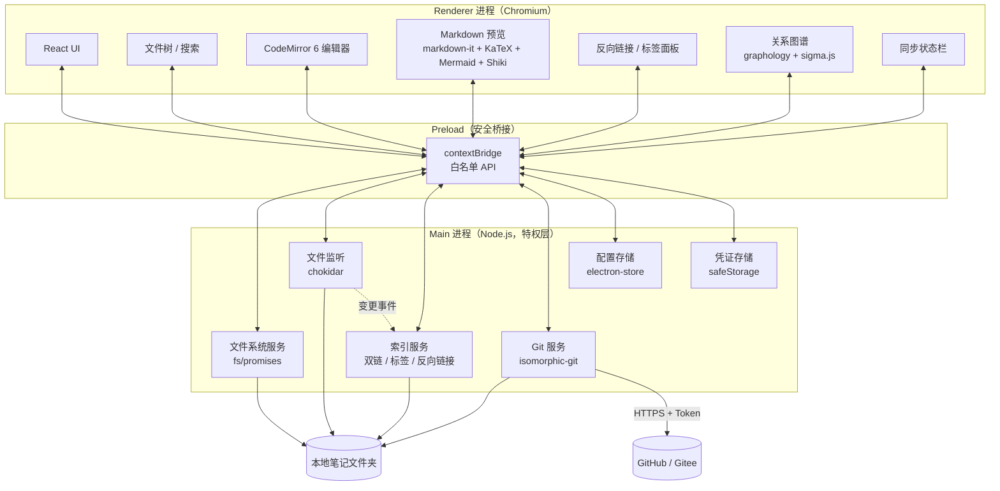

# 本地 Markdown 笔记软件 · 技术方案

> 版本：v1.1 · 日期：2026-09-29
> 决策记录：
> - 桌面外壳 = Electron + React + TypeScript
> - 编辑形态 = 源码 + 实时预览
> - Git 同步 = 保存落盘 + 手动一键同步（状态栏常驻未同步变更数）
> - 双链 = 完整版（`[[链接]]` + 反向链接 + 自动补全 + `#标签` + 关系图谱）
> - 平台 = 架构预留跨平台，v1 只发布并测试 macOS

---

## 1. 背景与目标

做一个**本地优先**的 Markdown 笔记软件：笔记以纯文件形式存在于用户自选的本地文件夹，第三方编辑器可共存；软件提供高质量的 Markdown 阅读与编辑体验，并把笔记目录接入 Git 仓库实现版本管理与多端同步。

### 1.1 核心功能

| # | 功能 | 说明 |
|---|---|---|
| F1 | 本地目录作为笔记库 | 用户自选一个本地文件夹作为"笔记本"，随时可更换 |
| F2 | 高质量 Markdown 支持 | 语法高亮、实时预览、公式、图表、代码块、任务列表等 |
| F3 | Git 仓库同步 | 可配置 GitHub / Gitee 等远程仓库，一键提交并推送 |
| F4 | 双链与知识关联 | `[[wiki-link]]` 双向链接、反向链接面板、链接自动补全、`#标签` 体系、关系图谱 |

### 1.2 明确不做（v1 范围外）

- 多端实时协同编辑（CRDT / OT）
- 移动端 App
- 云端托管与账号体系（同步完全依赖用户自己的 Git 仓库）
- 端到端加密（Git 仓库的安全由用户自行保障）

---

## 2. 需求分析与关键技术约束

四条核心需求各自都带一个硬约束，叠加之后技术路线基本被唯一确定：

| 需求 | 技术约束 | 推论 |
|---|---|---|
| F1 操作本地任意文件夹 | 需要真实文件系统读写权限 | 纯浏览器方案出局：File System Access API 仅 Chromium 支持，且目录句柄持久化在 IndexedDB 中，权限随时可能被回收，体验不可控 |
| F2 高质量 Markdown 渲染 | 需要成熟的 Web 渲染引擎 | 渲染生态（markdown-it / KaTeX / Mermaid / Shiki）全部基于 Web，Qt 或原生控件无对标方案 → **前端必须用 Web 技术** |
| F3 保存后同步到 Git 仓库 | 需要本地进程执行 Git 与网络请求 | 浏览器沙箱内无法写 `.git` 对象、无法发起带凭证的 push → **必须有本地进程** |
| F4 双链与反向链接 | 需要**全库索引层** | 反向链接、链接自动补全、标签、图谱都建立在"解析全库并建立链接倒排索引"之上 → M1 就要定好索引设计 |

**结论：桌面外壳 + Web 前端。** 这是唯一能同时满足上述需求的架构形态。

> 两条补充约束（来自已定决策，自 M1 起生效）：
> 1. 双链要求引入全库索引层，见 §5.4。
> 2. 跨平台预留要求路径、索引键、快捷键等**不得依赖 macOS 专有假设**，见 §3.4。

---

## 3. 技术栈选型

### 3.1 UI 形态：Web，无争议

"用 Web 还是别的方式"这个问题本身就有一个明确答案：**用 Web**。

理由：
1. Markdown 渲染的完整能力（GFM、数学公式、Mermaid 图表、Shiki 级代码高亮、双向滚动同步）只存在于 Web 生态。
2. 富文本/Markdown 编辑器的主流实现（CodeMirror 6、ProseMirror、Milkdown）都是 JS 库。
3. HTML/CSS 的主题定制能力远超任何原生 UI 框架，便于做阅读体验优化。

> 唯一需要讨论的不是"要不要 Web"，而是**用什么外壳承载 Web**。

### 3.2 桌面外壳候选对比

| 方案 | 体积 | 生态成熟度 | Git 实现方式 | 学习成本（对照现有技能） | 结论 |
|---|---|---|---|---|---|
| **Electron + React + TS** | ~150 MB | 最高（Obsidian / Typora / Logseq 同路线） | Node 侧 `isomorphic-git` 或系统 git | 需学 JS/TS，但资料最多、踩坑最少 | **选用** |
| Tauri (Rust) | ~10 MB | 成熟且增长快 | Rust `git2`（libgit2 绑定） | 需从零学 Rust，前期产出慢 | 备选 |
| Wails (Go) | ~15 MB | 一般 | 纯 Go `go-git`，无需系统装 git | Go 仅基础水平，风险中等 | 备选 |
| 本地服务 + 浏览器访问 | 0 | 类似 Jupyter | 后端可用 Python / Java | 无需学新前端框架，但不具备桌面应用形态：需管理端口、无系统托盘、无文件关联、无全局快捷键 | 否决 |

**决策：Electron 为主。** 笔记软件的核心竞争力在编辑与渲染体验，而非安装包体积；Electron 让团队把全部精力放在体验上，且 Obsidian 已验证此路线在 Markdown 笔记场景的可行性。

### 3.3 最终技术栈清单

| 层 | 选型 | 理由 |
|---|---|---|
| 桌面外壳 | Electron | 主进程提供 Node 全量能力（fs / 网络 / 子进程），渲染进程直接用 Chromium |
| 前端框架 | React + TypeScript | 生态最大；TS 在跨进程 IPC 数据结构上有明显收益 |
| 构建工具 | Vite（渲染进程）+ electron-vite / electron-builder | 快速 HMR + 成熟打包签名；electron-builder 多目标配置为 Windows 预留 |
| 编辑器 | CodeMirror 6 | 体积小、模块化、Markdown 支持好、性能优于 Monaco（更适合长文本笔记） |
| Markdown 解析 | markdown-it（+ 插件、+ 自定义 wikilink 规则） | 插件生态最全、可控性强、同步渲染性能好；**索引与渲染共用同一解析器**（见 §5.4） |
| 代码高亮 | Shiki | 与 VS Code 同源的 TextMate 语法，效果最佳；放 Web Worker 里避免阻塞 |
| 数学公式 | KaTeX | 渲染速度显著优于 MathJax |
| 图表 | Mermaid | 需求覆盖率最高 |
| 双链索引 | 复用 markdown-it token 流 + 内存倒排表 | 不引入第二套解析器，避免索引与渲染对语法理解出现分歧 |
| 链接补全 | fuse.js | 模糊匹配笔记标题与路径，支撑 `[[` 自动补全与快速打开 |
| 图谱可视化 | graphology + sigma.js | 笔记库节点可达数千，WebGL 渲染比 SVG 稳定；graphology 自带连通分量、社区发现等图算法。纯 SVG 的 d3-force 实现更简单，但不足以支撑大库，故不作默认 |
| 状态管理 | Zustand | 轻量、无样板代码，足够覆盖本场景 |
| 配置持久化 | electron-store | 主进程侧 JSON 配置读写 |
| 文件监听 | chokidar | 跨平台可靠；用于感知外部改动（git pull / 其他编辑器） |
| Git 操作 | isomorphic-git（默认）/ simple-git（可选） | 见 §5.3 |
| 凭证存储 | Electron `safeStorage` + 系统钥匙串 | 避免 token 明文落盘（Windows 下底层为 DPAPI） |

> 具体版本以初始化时各库最新稳定版为准，不在方案中锁死。

### 3.4 跨平台约束（M1 起生效）

v1 只发布 macOS，但**架构必须预留 Windows 支持**。成本规律是：M1 引入约束几乎零成本（纯纪律问题），M4 回头补则要返工路径处理、索引键与快捷键层。

| 约束项 | 规则 | 违反后果 |
|---|---|---|
| 路径 | 一律 `path.join` / `path.sep`，禁止字符串拼 `'/'`；比较前先 `path.normalize` | Windows 上路径全部失效 |
| 索引键 | 统一做**大小写折叠**（Windows 文件系统大小写不敏感） | `[[Note]]` 与 `[[note]]` 分裂为两个节点，出现"链接打不开但文件存在"这类极难排查的 bug |
| 文件名 | 新建时校验并**拒绝** Windows 非法字符 `\ / : * ? " < > \|`、保留名 `CON`/`PRN`/`AUX`/`NUL`/`COM1-9`/`LPT1-9`，以及以点开头的名称；校验函数位于 shared 层，主进程与界面共用同一套规则 | 放行的名字会让其他平台的检出失败；以点开头的文件在本应用中不可见 |
| 换行符 | 保留文件原有换行风格；仓库放置 `.gitattributes` | git diff 满屏噪声 |
| 路径长度 | 控制目录层级；必要时使用长路径前缀 | Windows 260 字符上限导致读写失败 |
| 快捷键 | 定义抽象层（`Mod+S` → macOS `Cmd` / Windows `Ctrl`） | 全部快捷键定义需重写 |
| 窗口装饰 | 标题栏按平台分支（macOS 红绿灯 / Windows 自定义） | 窗口层返工 |
| 打包 | electron-builder 预留多目标配置 | 发布流程返工 |

**验收方式**：以 `process.platform` 分支跑路径与索引键的单测，确保不硬编码分隔符、不依赖大小写敏感。

---

## 4. 系统架构

### 4.1 进程模型



**安全基线**：`nodeIntegration: false`、`contextIsolation: true`、`sandbox: true`；渲染进程不直接碰 fs / 网络，全部通过 preload 暴露的白名单 IPC 通道。

**窗口使用内存会话**（`partition` 不带 `persist:` 前缀）：Chromium 会为持久化的 cookies / localStorage 做加密，在 macOS 上这需要访问系统钥匙串，从而每次启动都弹出「Electron 想要使用您钥匙串中的机密信息」提示。本应用界面不使用任何 cookies 或 localStorage，改用内存会话即可切断这条链路，且不必像 `--use-mock-keychain` 那样牺牲凭证加密强度。

**外部链接**：`setWindowOpenHandler` 一律拒绝新建窗口；`will-navigate` 拦截同窗口跳转，把链接交给系统浏览器 —— 否则点击预览里的链接会直接离开应用界面。

### 4.2 目录结构（规划）

```
sandsea-notes/
├── package.json
├── electron.vite.config.ts
├── src/
│   ├── main/                 # 主进程
│   │   ├── index.ts          # 应用入口、窗口管理
│   │   ├── ipc/              # IPC 路由注册
│   │   ├── services/
│   │   │   ├── vault.ts      # 笔记库：目录选择/切换/扫描
│   │   │   ├── watcher.ts    # 文件监听
│   │   │   ├── indexer.ts    # 全库索引：双链/标签/反向链接
│   │   │   ├── linker.ts     # 链接解析与重命名联动
│   │   │   ├── git.ts        # Git 服务
│   │   │   └── config.ts     # 配置读写
│   │   └── protocols.ts      # 自定义协议（本地图片等资源）
│   ├── preload/
│   │   └── index.ts          # contextBridge 白名单 API
│   ├── shared/               # 主/渲染共用：IPC 契约类型、平台判断、快捷键映射
│   └── renderer/
│       ├── App.tsx
│       ├── components/       # 文件树、编辑器、预览、反向链接面板、同步面板
│       ├── graph/            # 关系图谱（sigma.js）
│       ├── editor/           # CodeMirror 配置与扩展
│       ├── markdown/         # markdown-it 管线与插件（含 wikilink 规则）
│       └── store/            # Zustand stores
└── resources/
```

---

## 5. 核心模块设计

### 5.1 笔记库（Vault）模块 — 对应 F1

**目录选择**
- 主进程 `dialog.showOpenDialog({ properties: ['openDirectory'] })` 获取绝对路径。
- 首次选择时扫描目录，建立文件树（只索引 `*.md` / `*.markdown` / 附件，忽略 `.git`、`node_modules`、可配置忽略规则）。

**随时更换**
- 路径存入 electron-store；更换时执行：停止旧 watcher → 卸载旧索引 → 清空渲染进程缓存状态 → 加载新目录。
- 更换目录**不触碰旧目录内容**，仅切换引用；是否需要提示"重新为 Git 配置"取决于新目录是否已是 Git 仓库（见 5.3）。

**文件监听（chokidar）**
- 监听新增/修改/删除/重命名，同步到文件树，并驱动索引层增量更新（见 5.4）。
- **必须忽略 `.git/`**：否则 git 操作产生的大量写入会触发事件风暴与死循环。
- 外部修改（其他编辑器或 `git pull`）→ 若当前文件未被本地编辑，直接重载；若正在编辑，提示"文件已被外部修改"由用户选择覆盖或重载。

**文件读写**
- 保存：停止输入 700 ms 后自动落盘，`Mod+S` 立即写入；切换文件前先 flush，避免未落盘的编辑丢失。
- 写回前比对 `mtime`：与上次读写不一致说明文件被外部改过，拒绝写入并提示，绝不静默覆盖对方的改动。
- 原子写入：先写临时文件再 `rename`，降低崩溃导致内容截断的风险；同时沿用文件原有换行风格（CRLF / LF），避免整文件 diff。
- 编码统一 UTF-8。

### 5.2 编辑与渲染模块 — 对应 F2

**编辑形态：源码 + 实时预览**
- 左侧 CodeMirror 6 源码，右侧预览面板；支持**单栏 / 双栏切换**、双栏滚动同步、拖拽分栏。
- CodeMirror 6 扩展：
  - `@codemirror/lang-markdown`：Markdown 语法高亮
  - 列表自动续行、Tab/Shift-Tab 缩进
  - `[[` 触发笔记标题自动补全（数据源为索引层，见 5.4）
  - 查找替换、括号匹配、行号、当前行高亮
  - 快捷键：`Mod+S` 保存、`Mod+B/I` 加粗斜体等（经快捷键抽象层映射）
- 轻量增强（可选开关）：当前行/选区内的 Markdown 标记做弱化渲染，兼顾"源码可读"与"所见即所得"的观感，但不引入 WYSIWYG 的复杂度。

**格式工具栏**（已实现）
- 编辑区上方按 `行内 / 标题 / 列表 / 插入` 分组排列常用格式按钮，按钮与快捷键共用 `editor/format.ts` 里的同一套动作实现，避免产生两套行为。
- 行内类（加粗 / 斜体 / 删除线 / 行内代码 / 链接）包裹选区；无选区时插入占位文字并选中，可直接输入替换。
- 行级类（H1-H3 / 无序 / 有序 / 待办 / 引用）是**开关式**的：选中行全部已应用该标记时取消，否则统一替换为它（不是叠加），且保留行首缩进。
- 块级类（代码块 / 表格 / Mermaid / 分隔线）插入可直接编辑的模板片段，必要时自动补空行。

**图片资源**（已实现）
- 粘贴 / 拖入图片 → 主进程落到**笔记库根目录的 `images/`** → 在光标处插入 ``。命名形如 `image-20260929-234654.jpg`；同秒内多张靠 `wx` 标志（目标存在即失败）递增序号，而不是「先探测再写」，后者存在竞态会让两张图互相覆盖。
- 主进程只接收**二进制内容 + 扩展名**，不接收来源路径 —— 渲染进程因此无法指使主进程读写笔记库外的文件。扩展名按白名单校验，单张上限 20 MB。
- 引用路径按笔记所在层级换算（`shared/notes.ts` 的 `relativePosixPath` / `resolvePosixPath`，纯函数，两个方向互为逆运算）。图片固定在根目录，所以笔记在子目录里会写成 `../images/x.png`。
- 渲染层用 markdown-it 的 **core ruler** 改写 image token 的 `src`：只改属性能复用 markdown-it 自身的 image 渲染（alt / title / 转义），自己重写渲染规则反而容易漏细节。带协议的地址（`http:` / `data:`）原样保留。
- 文件树里点击图片直接进右侧查看（等比缩放居中，无编辑链路）。因此 `openFile` 对图片短路：没有文本可读，也就没有「读进来 / 写回去 / 冲突检测」这套东西。

**图片尺寸**（已实现）
- 写法是 `{width=320}`（Pandoc / markdown-it attrs 体系的花括号属性，`height` 可选，单位像素）。**不放开 `html: false`** 的前提下，这是能持久化尺寸的写法；写成 `` 就得把原始 HTML 透传打开，粘贴外部内容时多一条 XSS 攻击面。
- 解析放在 core ruler：图片 token 后面若紧跟一个 `text` token 且以 `{...}` 开头，且里面含 `width`/`height` 数字属性，就把它摘掉并转成 token 属性。**认不出来就不摘**，免得吃掉正文里正常的花括号。
- 预览里图片被包进 `.image-frame`（`` 不能有子节点，而拖拽手柄需要一个能定位的父元素），右下角手柄拖动改宽度，松手写回源码；拖拽全程直接改 DOM 的 `style.width`，不走 React state —— 每帧 setState 会把整篇预览连同 Mermaid 一起重渲染。写回走编辑器 `dispatch`（`userEvent: 'input'`），因此能 `Cmd+Z` 撤回。
- **定位「预览里这张图 ↔ 源码里那段文字」**：markdown-it 的 inline token 不带位置信息，所以改用「出现序号 + 目标路径」双重校验 —— 序数说明是文档里第几张图（管线与编辑器语法树都按文档顺序计数，11 组用例实测一致），路径用来确认那一处确实引用了同一张图。加路径校验是因为 `syntaxTree` 对长文档是增量、按视口解析的，可能落后于文档，光看序号有改错地方的风险；校验不过就放弃改写并在底栏提示，不猜。
- 已知取舍：引用式图片（`![a][ref]`）在 Lezer 的语法树里没有 `URL` 子节点，拿不到地址无法校验，因此不支持拖拽调整。
- 顺带修掉一个真实 bug：markdown-it 会对链接地址做百分号编码（`images/中文图.png` → `images/%E4%B8%AD...png`），直接拿它拼 `notes-asset://` 会二次编码，中文文件名的图片渲染不出来。现在统一先经 `normalizeImageTarget`（去尖括号 + 解码）还原成真实路径再拼。

**文字颜色**（已实现）
- 语法 `[文字]{color=#c2635a}`，与图片的 `{width=320}` 同一套花括号属性。**不放开 `html: false`**：写成 `<span style="color:...">` 就得把原始 HTML 透传打开，粘贴外部内容时多一条 XSS 攻击面。
- 颜色值走**白名单**（十六进制，或 `red` / `blue` 这类颜色名）后才写进 `style` 属性 —— 否则 `{color=red;position:fixed}` 这种值虽然会被属性转义，但仍然能注入 CSS。认不出来的值原样当文本渲染，不猜。
- 用**行内规则**而非 core ruler：core ruler 的 state 上没有 `push`，造不出 token；行内规则恰好在 `[` 处被调用，与 markdown-it 自己的 `link` 规则同一个位置，写法可以直接照搬（临时收窄 `posMax` 到 `]`，让内部的加粗、行内代码在同一个 token 流里正常解析）。
- 「再点一次颜色是换色而不是套一层」靠 `editor/textColor.ts` 的 `findColorSpan`：用正则找出完全包住选区的标记，命中就只替换颜色值那一段。选区**切开**标记时会先把范围扩展到整个标记再替换 —— 否则源码里会留下半截 `{color=`。
- 已知取舍：颜色是硬编码色值，不随主题变化（用户选的颜色就应该是那个颜色）；预设色统一取中等明度，保证在白天与黑夜两种底色上都看得清。

**图片加载走自定义协议**（已实现）
- `notes-asset://vault/<笔记库内相对路径>`，主进程 `protocol.registerSchemesAsPrivileged`（`standard` + `secure`）+ `session.protocol.handle`。
- 为什么不用 `file://`：开发模式下渲染进程的源是 `http://localhost`，Chromium 不允许 http(s) 页面加载 `file://` 资源；退一步说，即便放开，页面也就拿到了整个文件系统的读权限。
- **踩过的坑**：`protocol.handle` 只对指定会话生效。窗口跑在 `partition: 'notes-memory'` 内存会话里，只注册到默认会话时，渲染进程会报 `net::ERR_UNKNOWN_URL_SCHEME` —— 主进程 `net.fetch` 能取到图，页面却认不出这个协议。
- 请求逐个校验：必须落在笔记库内（`..` 绕行由 `resolveInsideVault` 兜底，含 `%2e%2e%2f` 这类先解码后拼接的写法），且扩展名在图片白名单内；其余一律 404。响应带长缓存，避免预览每次重建 DOM 都重新读盘。

**渲染管线**

```
Markdown 文本
  → markdown-it（GFM 基础：表格 / 删除线 / 自动链接）
  → 插件链
      ├─ markdown-it-task-lists   任务列表 [ ]
      ├─ markdown-it-footnote     脚注
      ├─ markdown-it-katex        行内/块级公式（KaTeX 渲染）
      ├─ 自定义 wikilink 规则      [[目标]] / [[目标|别名]] / [[目标#标题]]
      ├─ mermaid 代码块切分        不接插件，渲染前按顶层 fence 切成独立片段
      ├─ Shiki                    代码块高亮（Web Worker 内执行）
      └─ TOC / 锚点                标题锚点与目录
  → 安全净化（见下）
  → HTML → React 渲染
```

**渲染性能**
- 预览渲染走 `useDeferredValue`，避免每次按键都重跑整篇 Markdown；超长文档（>5000 行）后续再考虑可视区渲染。
- **Mermaid 采用「切片段」而非整篇渲染**（已实现）：`markdown/pipeline.ts` 把 token 流切成 `html` / `mermaid` 两类片段，图表交给独立的 React 组件，用「内容 hash + 出现序号」做稳定 key。因为预览每次更新都会重建 DOM，若整篇渲染后再处理，所有图表都会跟着重跑一次解析与布局。
- Mermaid 体积很大（核心 chunk 约 1.2MB），因此走动态 `import()` 懒加载，只有文档里真的出现图表时才加载；`securityLevel: 'strict'` 启用其自身净化，`suppressErrorRendering` 关掉它自带的错误图，渲染失败由组件在原位展示源码与错误信息。
- Shiki 计划在 Web Worker 中执行（未实现）。

**分栏滚动同步**（已实现）
- 不用「滚动百分比对齐」：编辑器行高固定，预览里却有图片、表格、图表，两边内容总高度差得很远（同一篇笔记实测 1626px vs 2100px），按比例映射遇上大图或长代码块就会错位，而且越滚越偏。
- 基准改用**源码行号**：`markdown/pipeline.ts` 用 core ruler 给预览的顶层块打 `data-line`（只标 level 0，免得嵌套块堆出层层叠叠的锚点），由此得到「源码行 ↔ 预览纵向位置」对照表；两个方向都先换算成源码行再落位，两端补哨兵以保证滚到顶 / 底时预览刚好贴边。
- 坐标换算只在屏幕坐标里做：`screenOrigin = view.documentTop - view.lineBlockAt(0).top` 即文档原点的屏幕位置。这样写不必去判断「文档原点在内容内边距之上还是之下」，调整 `.cm-content` 的 padding 也不会失效。
- 程序化滚动后 80ms 内忽略对方冒出来的 scroll 事件，否则两边互相触发会抖个不停。
- 分栏时用 CSS 把编辑器滚动条画成 0 宽（`.panes[data-mode='split'] .cm-scroller::-webkit-scrollbar`），只留预览那一条；滚动本身不受影响。
- 实现见 `src/renderer/src/editor/scrollSync.ts`。

**预览内直接编辑**（已实现）

预览是渲染出来的只读 DOM，要在上面勾待办、改单元格、增删行列，就得把「DOM 上的操作」翻译成「源码里的某一段文字」。

- 定位统一用「行号 + 行列下标」：行号由 core ruler 打在元素上（`data-task-line` 挂在 `list_item_open`；表格用 `data-line` / `data-line-end` 框出行范围），行列下标直接读 DOM 的 `rowIndex` / `cellIndex`，不另算一遍。
- `data-task-line` 必须注册在 `markdown-it-task-lists` **之后**（`core.ruler.after('github-task-lists', ...)`）：任务项是先被那个插件打上 `class="task-list-item"` 才认得出来的。
- 复选框改用 `{ enabled: true }` 渲染。默认的 `disabled` 不只是不能点 —— 浏览器连 click 事件都不派发，挂在容器上的事件委托也收不到。
- `contenteditable` 只加在 `td` / `th` 上。
- 行列结构操作走**单元格右键菜单**（复用 `ContextMenu`，另加了一条分组分隔线）。此前是一条常驻浮出的操作条，先挂在表格容器里、后改成锚在光标那一格下方的 `fixed` 浮层 —— 怎么摆都压正文：表格就那么几行，浮层再小也挡着相邻行。菜单不占任何版面，还能把「剪切 / 复制 / 粘贴」一起收进来，正好补上「换成自绘菜单就没了浏览器原生菜单」这个缺口；表格**之外**仍放行原生菜单，读笔记时复制、查询照旧。两个约束：菜单按钮的 `mousedown` 必须 `preventDefault`，否则点菜单会把单元格的焦点和光标抢走，「粘贴」就没地方可插；「删除本行 / 删除本列」按上下文置灰（表头行、只剩一列），不再让用户点了才被静默拒绝。
- 用 markdown-it 实测确认过两件事：`table_open.map` 是**左闭右开**（`data-line = map[0]+1`、`data-line-end = map[1]`）；只有表头和分隔行、没有数据行的表格照样能解析，所以把数据行删到零是安全的。
- **单元格写回：停手 ~400ms 就写，写完把光标补回去**。写回会让预览重渲染、`dangerouslySetInnerHTML` 换掉整段 DOM，格子连同光标一起被重建。早先的做法是「攒到离开整张表再写」——不用补光标，但左边源码要等你点走才更新，看着很迟钝。现在改成定时写回 + 补光标：写之前记下「哪张表（`data-line`）+ 行列下标 + 格内字符偏移」，重渲染后的 layout effect 里按同样的坐标把格子找回来、把光标放回原偏移（`placeCaretAt` 走 TreeWalker 数文本节点）。光标补不回来（比如有选区）就干脆这次不写，内容仍留在待写表里，离开表格时会补上，总好过把别人的选区毁掉。
- **输入法组字期间一个字都不能碰 DOM**：`compositionstart` 到 `compositionend` 之间写回会重渲染，候选词直接断掉。这段期间取消定时器，`compositionend` 之后再重新计时。
- 一次写回用 `view.dispatch({ changes: [...] })` 提交多个互不重叠的区间；执行结构操作（插行 / 删列）之前也先冲一次，免得结构变了、没写完的内容丢在半路。
- 单元格按**纯文本**写回（原格子的加粗、链接、行内代码会被替换成文本），内容里的 `|` 与 `\` 都转义。整格原本是空白时按 `| x |` 的标准写法补两侧空格 —— 原样沿用那点空白会全挤到一侧，写成 `|  na|`。
- 增删列按「**整行重排**」处理：逐格插竖线会把间距越插越乱。重排前先比对各行列数是否与表头一致，不一致就整张表都不动，免得把手写的表格改了形；分隔行重排时要补 `---`。
- 表头行点「上方插入」会落到第一行数据的位置；表头行与最后一列都不允许删（删掉表格就不成立了）。
- 实现见 `src/renderer/src/editor/previewAction.ts` 与 `src/renderer/src/components/Preview.tsx`。

> **实现进度**：编辑形态（CodeMirror 6 源码编辑 + 自动保存 + 冲突保护）、格式工具栏（行内 / 标题 / 列表 / 插入四组动作，含 `Mod+B/I`、`Tab` 缩进、表格行列选择器、文字颜色）、视图切换（编辑 / 分栏 / 阅读）、分栏滚动同步、markdown-it 的 GFM 表格 / 任务列表 / 脚注、Mermaid 图表渲染、图片粘贴 / 拖入 / 查看 / 拖拽改尺寸、预览内直接编辑（勾选待办 / 改单元格 / 增删行列）、以及协议加载均已落地。
> KaTeX 公式、Shiki 代码高亮、wikilink 规则尚未实现。

**安全**
- 默认关闭 markdown-it 的原始 HTML 透传，或对输出过 DOMPurify。本地笔记虽然风险低，但粘贴外部内容时仍是攻击面。
- 渲染进程启用 CSP，禁止远程脚本。策略只在构建产物里注入（`electron.vite.config.ts` 的 `apply: 'build'`）—— 开发模式下 Vite 依赖内联脚本与 HMR 的 WebSocket，强 CSP 会直接打断热更新。
- **踩过的坑**：`img-src` 里的自定义协议必须与 `ASSET_SCHEME` 逐字一致（`notes-asset:`，不是 `notes:`）。写成别的名字时开发模式一切正常（dev 不注入 CSP），**只有打包后图片会被静默拦掉**。这条路径已用构建产物实测过：`file://` 加载 + CSP 生效时协议图片、预览、图片查看器都正常，且无 CSP 违规。

**本地资源**
- 图片/附件的相对路径无法被 Chromium 直接加载，需注册自定义协议（`protocol.handle('notes-asset', ...)`）映射到笔记库根目录，并按根目录做路径越权校验。避免为了加载图片而放宽 `webSecurity`。

### 5.3 Git 同步模块 — 对应 F3

**策略：保存落盘，手动一键同步**

- 编辑过程完全静默：`Mod+S` 只落盘，不做任何网络与 Git 操作。
- 状态栏常驻显示：`未同步 N 个文件的改动`；一键同步按钮 + 全局快捷键触发。
- 点击同步后流程：

```
1. 检查仓库状态（是否已初始化 / 有无变更 / 有无上游）
2. 无变更 → 直接提示"没有需要同步的改动"
3. 有变更：
   a. fetch 并检查远端是否领先
      ├─ 领先   → 返回 behind，不产生任何提交（见下方"远端领先的出口"）
      └─ 未领先 ↓
   b. git add -A（按 .gitignore 排除）
   c. git commit（提交信息自动生成，可在弹窗中编辑）
   d. git push
4. 结果反馈到 UI：成功 / 认证失败 / 远端领先（附变更文件清单与处理建议）
```

> 顺序上刻意先查远端再提交：若远端存在本地没有的提交，就不产生一个注定推不上去的提交，避免把历史搞乱。

**远端领先的出口（不自动 rebase / merge）**

远端领先时推送必然被拒。此时弹窗保持打开，并在弹窗内给出说明与两个动作：

1. **仅提交到本地**（新增）—— `git commit` 但不 `push`。目的是先把改动存入版本历史，使工作区变干净，否则连快进拉取都做不了（拉取会覆盖未提交的改动，因此被拒绝）。
2. **拉取**（状态栏）—— 仅快进式：本地提交必须是远端的祖先。历史已分叉时明确报错并提示手工处理。

应用内不提供冲突解决；状态栏在报错状态会显示「打开笔记库文件夹」，交由用户用外部工具处理。这样设计的原因是：自动 rebase / merge 存在丢内容的风险，与"笔记数据不可静默篡改"的前提冲突。

**提交信息生成**
- 默认模板只有时间戳，形如 `2026-10-02 22:30`。（早先还带 `N 个文件变更`，后来去掉了：改了多少在提交弹窗与历史的文件列表里一眼可见，写进信息只是重复。）提交前允许在弹窗中编辑。
- 时间戳在每次状态刷新、以及打开提交弹窗时重算，避免弹窗里显示的是一小时前的「现在」。
- 模板末尾刻意留两个空格：输入框聚焦后光标落在那儿，接着往下写时手边有余量。这两个空格**不会进提交对象** —— 提交前 `resolveCommitMessage` 会 `trim()`，落进 git 的信息与命令行 `git commit -m` 的结果一致（git 自己的默认 cleanup 也是 strip，实测加 `--cleanup=verbatim` 才会保留尾随空格）。

**本地版本历史默认开启（首次接入的默认路径）**

打开一个文件夹当笔记库时，若它不是 Git 仓库，就地 `git init` 并写默认 `.gitignore`，不接远程。这条主线是后来定的：本地历史才是这个应用的主用法，「只想要本地版本历史」不该要求用户先去设置里找到一个开关。渲染层监听仓库状态，`no-repo` 时自动调一次 `git:init-local`（用 ref 去重，避免 StrictMode 下 effect 双跑并发写 `.git`）；失败就在状态栏报出来，设置里留一个「立即开启」的重试入口。

由此派生出三条路：

1. **只想要本地历史** —— 打开文件夹自动完成，零配置。
2. **要接远程** —— 仓库已由 1 建好，设置里填地址保存即可（`git:setup` 在目录已是仓库时直接 `remote set-url`），不必再有一个「初始化并接入」的按钮。
3. **远程上已有仓库** —— `git:clone`：克隆到本地并切换笔记库。本地尚无提交时快进拉取也能走通（`fastForwardPull` 对 unborn HEAD 直接写引用），但那条路要求用户先知道去点「拉取」，所以克隆仍保留为显式入口。

**提交署名必须有默认值**

git 没有 `user.name` / `user.email` 就拒绝生成提交。署名留空会把「打开笔记库就能记历史」这条主线堵在一个必填项上，因此默认取系统用户名与 `用户名@localhost`，设置里可改；`readGitConfig` 把空串一并当缺省处理，旧配置里的空邮箱也会被补上。

**历史查看与单文件恢复**

仓库一旦存在（配没配远程都算），状态栏出现「历史」入口，面板分三层：提交列表 → 该提交改动的文件 → 选中的那个文件的行级差异。

- **文件列表带行级统计**：`CommitFile` 里有 `added` / `removed` / `skipped`，列表上直接显示 `+N −M`。统计是在 `commitFiles` 里复用单文件差异算出来的 —— 取父子两份内容的逻辑只写一遍，代价是列表操作会多读一遍 blob；笔记库规模下这点开销可以接受，而且 `buildFileDiff` 本身有体积与 DP 格子数上限，不会出现算不动的情况。图片按扩展名直接标 `skipped`，与点开时的提示保持一致，免得列表上冒出一堆没有意义的增删计数。
- **差异计算自研**，不引第三方 diff 库：先掐掉首尾相同的行，再对中间部分跑 LCS 动态规划回溯，`MAX_DIFF_CELLS = 4_000_000` 封顶，超限与二进制（含 NUL）都返回 `skipped` 而不是硬算。
- **恢复只改一个文件，且不自动提交**：读该提交下的 blob 写回工作区，恢复结果算作一个待提交的改动，让用户在正常流程里过一眼再决定。
  - 刻意**不使用 `git.checkout({ filepaths })`**：isomorphic-git 的实现在 `filepaths` 分支里仍然会执行 `if (!noUpdateHead) writeSymbolicRef(...)`，即「恢复一个文件」会把 HEAD 挪到那次旧提交上，工作区被整体改写。这一点是实测发现的（恢复前后 `git rev-list --count HEAD` 从 2 变成 1），不是推测。
- **未保存的改动会被拦下**：若目标文件正在编辑器里且 `content !== savedContent`，恢复前先中止并提示，否则文件监听会把用户的改动无声替换掉。

> `isomorphic-git` 的 `statusMatrix` 会返回仓库里的**每一个**文件，没改动的行是 `[1,1,1]`。变更列表必须把 `head === workdir === stage` 的行过滤掉，否则状态栏的「未同步 N 个文件」会等于文件总数，提交信息里的数量也会跟着虚高（实测：只改 1 个文件却报 3 个）。

**提交前先看改了什么**

提交弹窗里列出待提交的文件，每个文件带行数，点任一文件就地展开「工作区相对 HEAD」的逐行差异（`workingFileDiff` / `workingStats`，走 `git:working-diff` / `git:working-stats`）。此前只有文件名加「新增 / 修改 / 删除」标签，用户在按下提交前没法确认改的到底是什么。

两份内容的来源不同：HEAD 那份只有各后端拿得到（内置实现 `readBlob`、系统 git 用 `show HEAD:path`），工作区那份都是从磁盘读 —— 所以读盘、体积判定与差异组装共用 `workingDiffFrom`，两个后端各传一个 before 进去即可。删除的文件读不到、before 为空，差异自然表现为整份删除。

行数走**整批**接口：打开弹窗时一次把「路径 → +N/−M」取回，而不是每个文件单独请求（那是 N 次 IPC 往返）。两处的改动列表共用 `ChangeList`，差异渲染共用 `DiffView`（两边「差异为空」的语义不同，文案由调用方给）。

**两处共用一套「左边选、右边看」的检视交互**

- **提交弹窗**：文件列表 | 差异（两栏）
- **历史面板**：提交记录 | 改动文件 | 差异（三栏）

共同点是每一栏都常驻、层层向右联动，所以没有「返回上一级」这种按钮。历史面板曾经是两栏 + 右栏在「文件列表」与「差异」之间就地切换 + 一个返回键 —— 三层信息里总有一层要被替换掉；改成三栏后三层同时可见，翻历史时不用来回进出。

分栏抽成 `.review` 这组类（`.review--three` 是三栏变体），列表与详情各自定义样式。宽度上三栏合计 210 + 180 + 剩余，弹窗放宽到 1040px。

**分栏高度写死（420px），右栏长内容自己滚。** 跟着内容走的话，点不同文件/提交时整个弹窗会忽高忽低。两个坑：只给容器 `height` 不够，内容更高时网格行会跟着长出去（得配 `grid-template-rows: minmax(0, 1fr)` 把行也钉死）；右栏作为 flex 容器还需要 `min-height: 0`，否则子项按内容的最小尺寸撑住、缩不下来。实测：3 行的差异与 240 行的差异，弹窗高度都是 677px，后者在差异区内滚动。

**打开即选中**：历史面板打开时选中最新提交、以及它改动的第一个文件；提交弹窗打开时选中第一个待提交文件。都是为了让右侧一开就有内容，不必先自己点一下才知道那里能看什么。

**Git 实现选型**

| 实现 | 优势 | 劣势 | 定位 |
|---|---|---|---|
| **isomorphic-git**（默认） | 纯 JS，无需用户安装 git；运行在主进程 Node 环境，无 CORS 问题 | 不支持 SSH；大仓库性能一般；部分高级特性缺失 | 默认方案，零依赖，降低使用门槛 |
| simple-git（可选） | 调用系统 git，行为与命令行完全一致，支持 SSH | 要求用户本机已安装 git | 提供给高级用户的可切换后端 |

- 抽象 `GitProvider` 接口，实现可插拔。默认 isomorphic-git，设置中可切换为系统 git。
- **认证**：HTTPS + Personal Access Token（GitHub 用 Fine-grained PAT，Gitee 用私人令牌），不支持账号密码。Token 通过 `safeStorage` 加密后存储，仅在内存中解密使用，绝不写入笔记目录或日志。
  - 状态查询（状态栏刷新、应用启动）**只判断密文是否存在、不做解密**，解密只发生在真正需要凭证的同步 / 拉取 / 克隆操作。原因：macOS 上访问钥匙串会弹出系统授权提示，若在状态查询里解密，每次打开应用都会弹一次。
  - 凭证可在设置中一键清除（`git:clear-credential`），清除后需重新填写。
- **默认 .gitignore**：忽略 `.DS_Store`、`node_modules/`、`Thumbs.db`，以及本软件自身的配置/缓存目录；不忽略任何用户笔记内容。

**冲突与异常处理**
- 不自动执行 `rebase` / `force push` 等有损操作，一律提示用户，必要时提供"打开终端/在文件管理器中查看"的出口。
- 网络失败、认证失败、远程被 force push 等情况均有明确的可读错误提示，而非抛原始异常。

### 5.4 索引与双链模块 — 对应 F4

这是 F4 的地基：**没有索引层，反向链接、自动补全、标签、图谱全都做不了。** 有了它，图谱只是多一个可视化组件。

**索引层职责**
- 启动时全量扫描笔记库，解析每个 `.md`，提取：`[[wiki-link]]`、标准 `[文本](路径)`、`#tag`、附件引用。
- 建立三张倒排表：正向链接（文件 → 链接目标）、反向链接（文件 → 谁引用了它）、标签（标签 → 文件）。
- 索引常驻内存，**不引入数据库**：1 万篇笔记量级内存占用仅数 MB。启动时按文件 mtime 比对做增量重建，仅重解析变化的文件。

**增量更新**
- 索引挂在 watcher 上：保存 / 新增 / 删除 / 重命名 → 只重解析该文件，与旧链接集合做 diff，更新反向链接与标签表。
- 目标是"保存后反向链接面板立刻正确"的体感，单文件增量更新须控制在 20 ms 量级。

**链接语法与解析**
- 支持 `[[目标]]`、`[[目标|显示文本]]`、`[[目标#标题]]` 三种形式。
- **单一解析器原则**：复用同一个 markdown-it 实例与自定义 inline 规则做索引提取，**不引入第二套解析器**（如 remark）。若用两套解析器，必然出现"预览里渲染成了链接、索引却没识别"的偏差，这类 bug 极难定位。
- 索引键统一做大小写折叠（见 §3.4）。

**兼容性（关键设计）**
- `[[...]]` 不是标准 Markdown，Typora / VS Code 不识别它。由于本项目笔记文件天然要与 Git 及其他编辑器共存，因此**同时支持标准 `[文本](路径.md)`**，内部统一归一化为"链接"参与索引与图谱。
- 新建链接的默认输出语法可配置（见 §10.2），不强制用户使用私有语法，保证笔记文件脱离本软件仍可读。

**未创建链接（红链）**
- 指向不存在文件的链接标记为"未创建"，预览中以区别样式呈现，点击即按标题创建新文件。

**重命名联动**
- 本方案采纳建议：**默认启用，设置中可关闭**。重命名文件时，索引层找出所有指向它的链接并批量改写为新名称。
- 这是唯一会**批量修改用户文件内容**的操作，必须满足三条安全要求：变更前展示待修改文件清单并等待确认 → 一次性原子写入 → 可依赖 Git 回退。

**关系图谱**
- graphology 构图 + sigma.js（WebGL）渲染；节点为笔记，边为链接。
- 支持按标签着色、点击节点跳转、局部/全局视图切换。
- **大库降级**：节点数超过阈值（默认 2000）时，默认只展示当前笔记的 N 跳邻域，避免全图渲染拖垮 UI。

### 5.5 配置与状态

| 配置项 | 存储位置 |
|---|---|
| 当前笔记库路径、最近使用的库列表 | electron-store |
| Git 远程地址、分支、用户名/邮箱、认证方式 | electron-store |
| Git Token | safeStorage 加密后单独存放，与普通配置隔离 |
| 编辑器偏好（字号、主题、双栏比例、自动保存间隔） | electron-store |
| 界面主题（跟随系统 / 白天 / 黑夜） | electron-store，经 `prefs:get` / `prefs:set` 读写 |
| 双链偏好（默认链接语法、重命名联动开关、图谱阈值与默认视图） | electron-store |
| 会话态（当前打开文件、滚动位置、展开的目录） | electron-store |

渲染进程状态用 Zustand 管理，与主进程通过 IPC 双向同步；配置变更走"主进程为唯一真源"的原则，避免两处状态不一致。

---

## 6. IPC 接口设计（初稿）

| 通道 | 方向 | 说明 |
|---|---|---|
| `vault:select` | R → M | 打开目录选择对话框，返回路径 |
| `vault:switch` | R → M | 切换笔记库 |
| `vault:tree` | R → M | 获取文件树 |
| `file:read` / `file:write` | R → M | 读 / 写文件 |
| `file:rename` / `file:delete` / `file:create` / `folder:create` | R → M | 文件与文件夹操作 |
| `watch:event` | M → R | 文件变更事件推送 |
| `index:backlinks` | R → M | 查询某文件的反向链接 |
| `index:tags` | R → M | 标签列表及标签下的文件 |
| `index:suggest` | R → M | 链接自动补全候选（模糊匹配） |
| `index:graph` | R → M | 获取图谱数据（节点 + 边） |
| `index:resolve` | R → M | 解析链接目标，返回存在 / 未创建状态 |
| `link:rename` | R → M | 重命名文件并联动改写指向它的链接 |
| `git:status` | R → M | 仓库状态、未同步变更数 |
| `git:sync` | R → M | 执行一键同步，返回结果 |
| `git:setup` | R → M | 配置远程地址与提交署名 |
| `git:init-local` | R → M | 只建本地仓库（自动开启失败时的重试入口） |
| `config:get` / `config:set` | R → M | 配置读写 |

所有通道在 preload 中以显式白名单暴露，不暴露通用 `invoke(channel, ...)`。

---

## 7. 非功能需求

| 维度 | 目标 |
|---|---|
| 启动速度 | 冷启动 < 2 s；含 1 万笔记的全量索引 < 3 s（可先出 UI 再后台建索引） |
| 索引性能 | 单文件增量更新 < 20 ms（保证反向链接面板即时正确） |
| 大库性能 | 1 万笔记下文件树流畅滚动；搜索响应 < 500 ms |
| 图谱性能 | 2000 节点以内全图交互流畅；超出则降级为邻域视图 |
| 编辑流畅度 | 输入无可感知延迟（渲染、高亮、索引解析全部异步化） |
| 数据安全 | 原子写入；Git 版本历史；不自动执行破坏性 Git 操作；批量改写文件前必须确认 |
| 隐私 | 除用户配置的 Git 远程外，无任何外部网络请求（无遥测、无 CDN 依赖，字体与高亮主题全部本地打包） |
| 跨平台 | v1 发布 macOS；路径、索引键、快捷键、窗口装饰自 M1 起按跨平台规则实现（见 §3.4） |

**搜索方案（v1 可后置）**：优先 `ripgrep` 子进程（快、增量、支持正则）；若不希望依赖外部二进制，退化为 `minisearch` 前端索引。

---

## 8. 主要技术风险与对策

| 风险 | 影响 | 对策 |
|---|---|---|
| `.git/` 被文件监听捕获，形成事件风暴 | CPU 占满、UI 卡死 | watcher 强制忽略 `.git/`，git 操作期间暂停监听或加锁 |
| 索引与渲染对语法理解不一致 | 链接渲染异常、反向链接缺失且难排查 | 复用同一 markdown-it 实例与自定义规则（单一解析器原则） |
| 重命名联动误改用户文件 | 内容被批量篡改 | 变更前预览清单 + 用户确认 + 一次性原子写入 + 依赖 Git 可回退 |
| 跨平台假设泄漏（大小写、路径分隔符） | 后期支持 Windows 时大规模返工 | §3.4 约束自 M1 生效，路径与索引键单测覆盖 |
| 大库图谱渲染卡顿 | UI 冻结 | WebGL 渲染 + 邻域降级 + 图布局计算移出主线程 |
| Git Token 泄露 | 账号风险 | safeStorage 加密、不落日志、不写入笔记目录；文档明确提示使用最小权限 PAT |
| 外部修改与本地编辑冲突 | 内容丢失 | 引入 mtime + 内容 hash 双校验，冲突时提示而非静默覆盖 |
| 大文档渲染卡顿 | 体验差 | 渲染防抖 + Worker 内高亮 + 超长文档降级策略 |
| 远程历史被改写（force push） | 同步失败或误覆盖 | 同步前 fetch 检测，异常情况下拒绝自动操作并提示用户 |
| Electron 体积与内存 | 用户感知 | 接受代价；通过 `electron-builder` 做体积裁剪，关闭不需要的 Chromium 特性 |

---

## 9. 开发里程碑

先交付原始的三条需求（F1–F3），再交付知识关联层（F4）。

| 阶段 | 内容 | 交付物 |
|---|---|---|
| M1 骨架 | Electron + React + TS 脚手架、双进程 IPC 安全桥、**跨平台约束基座（路径 / 快捷键抽象 / shared 契约类型）**、目录选择与切换、文件树 | 可选择笔记库并浏览文件 |
| M2 编辑与渲染 | CodeMirror 集成、markdown-it 管线（表格 / 任务 / 脚注）、KaTeX、Shiki、Mermaid、双栏与滚动同步 | 可用的 Markdown 编辑与高质量预览 |
| M3 Git 同步 | GitProvider 抽象、isomorphic-git 接入、凭证加密存储、一键同步与状态栏、首次接入流程 | 笔记可推送至 GitHub / Gitee（F1–F3 闭环） |
| M4 索引与双链 | 全库索引层（双链 / 标签 / 反向链接）、wikilink 语法与标准链接兼容、`[[` 自动补全、红链、重命名联动 | 笔记之间可双向关联与跳转 |
| M5 关系图谱 | graphology + sigma.js 图谱视图、按标签着色、邻域降级策略 | 知识关联可视化 |
| M6 打磨 | 全文搜索、主题与排版优化、快捷键体系完善、外部变更处理、错误提示完善 | 可日常使用的 v1.0 |

---

## 10. 决策与待确认事项

### 10.1 已确认（截至 v1.1）

| 事项 | 结论 |
|---|---|
| 桌面外壳 | Electron + React + TypeScript |
| 编辑形态 | 源码 + 实时预览 |
| Git 同步 | 保存落盘 + 手动一键同步（状态栏常驻未同步变更数） |
| 双链范围 | 完整版：`[[链接]]` + 反向链接 + 自动补全 + `#标签` + 关系图谱 |
| 平台 | 架构预留跨平台，v1 只发布并测试 macOS |
| 应用名与数据目录 | 项目名 `sandsea-notes`、显示名「Sandsea Notes」（`APP_NAME` / `productName` / bundle id `com.sandsea.notes`），用户数据目录固定 `Notes`。显示名与数据目录刻意分开：改显示名不迁移目录，避免既有笔记库路径、主题与 Git 设置读不到。 |
| 重命名联动 | 默认启用，可在设置中关闭；执行前必须用户确认 |

### 10.2 待确认（不影响架构定案，影响 M4/M6 工作量）

1. **默认链接语法**：新建链接默认写标准 `[文本](路径.md)` 还是 `[[目标]]`？（前者与其他编辑器兼容性更好，后者书写更快）
2. **附件管理**：粘贴图片时复制进笔记库并生成相对路径，还是引用外部路径？
3. **搜索依赖**：是否接受依赖外部 `ripgrep` 二进制？
4. **主题范围**：仅深浅色两套，还是提供可自定义的排版参数（行宽、行高、字体）？
5. **图谱默认视图**：默认全图还是当前笔记邻域？邻域降级阈值取多少（当前预设 2000 节点）？

---

## 附：决策摘要

- UI 形态结论：**Web**（Markdown 渲染生态决定，非偏好问题）
- 桌面外壳：**Electron + React + TypeScript**
- 编辑形态：**源码 + 实时预览**（CodeMirror 6 + markdown-it）
- Git 策略：**保存落盘、手动一键同步**，默认 isomorphic-git，Token 加密存储
- 双链策略：**完整版含关系图谱**，索引层复用 markdown-it（单一解析器原则），同时兼容标准 Markdown 链接
- 平台策略：**架构预留跨平台，v1 只发 macOS**；M1 即落地路径 / 索引键 / 快捷键约束
- 核心原则：
  1. 主进程持有全部特权与真源状态，渲染进程只通过白名单 IPC 访问
  2. 不做任何自动的有损 Git 操作
  3. 任何批量修改用户文件的操作都必须先确认、可回退
